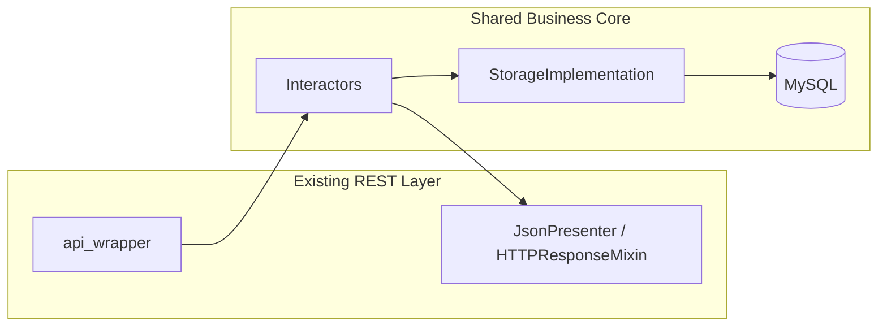
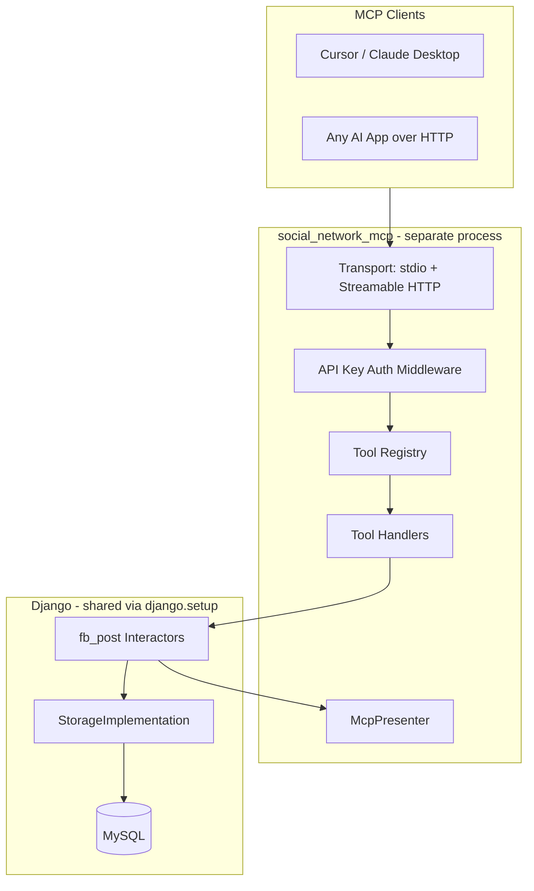

# Production-Scale MCP Server for Social Network

## Current State

Your [`fb_post`](fb_post/) app is a solid foundation:

- **5 REST endpoints** fully implemented (`ENV_IMPL`): `create_post`, `get_post`, `create_comment`, `react_to_post`, `delete_post`
- **Clean architecture** already in place: `api_wrapper → interactor → storage / presenter`
- **No MCP code exists yet** — this is greenfield on top of working business logic



## Target Architecture

Add MCP as a **second interface layer** — same pattern as REST views, different presenter:



**Key principle:** MCP tool handlers do exactly what [`api_wrapper.py`](fb_post/views/create_post/api_wrapper.py) files do — parse inputs, instantiate storage + interactor + presenter, delegate. Zero business logic in the MCP layer.

---

## Package Structure

Create a new top-level package (not a Django app):

```
social_network/
├── fb_post/                          # unchanged business logic
├── social_network_mcp/               # NEW
│   ├── __init__.py
│   ├── __main__.py                   # python -m social_network_mcp
│   ├── bootstrap.py                  # django.setup() + settings init
│   ├── config.py                     # env-based settings (port, auth, transport)
│   ├── server.py                     # FastMCP server factory
│   ├── auth/
│   │   └── api_key_validator.py      # validate X-API-Key / Bearer token
│   ├── presenters/
│   │   └── mcp_presenter.py          # mirrors JsonPresenter, returns dict not HttpResponse
│   ├── tools/
│   │   ├── __init__.py               # register all tools
│   │   ├── create_post_tool.py
│   │   ├── get_post_tool.py
│   │   ├── create_comment_tool.py
│   │   ├── react_to_post_tool.py
│   │   └── delete_post_tool.py
│   └── adapters/
│       └── tool_result_adapter.py    # dict → MCP CallToolResult (JSON text)
├── Dockerfile.mcp                    # optional, phase 2
└── pyproject.toml                    # add mcp dependency + package entry
```

---

## Layer-by-Layer Design

### 1. Django Bootstrap ([`bootstrap.py`](social_network_mcp/bootstrap.py))

MCP runs as a **separate process** but shares the Django ORM and interactors:

```python
import os, django
os.environ.setdefault("DJANGO_SETTINGS_MODULE", "social_network.settings.local")
django.setup()
```

Call this once at server startup, before importing any `fb_post.*` modules.

### 2. MCP Presenter ([`presenters/mcp_presenter.py`](social_network_mcp/presenters/mcp_presenter.py))

Mirror [`JsonPresenter`](fb_post/presenters/json_presenter.py) methods but return structured dicts instead of `HttpResponse`:

```python
# Success
{"ok": True, "status": 201, "data": {"post_id": 42}}

# Error
{"ok": False, "status": 400, "error": {"response": "...", "res_status": "INVALID_USER_EXCEPTION"}}
```

This keeps interactors unchanged — they already call `presenter.prepare_200_success_response(...)` and `presenter.raise_exception_for_invalid_user()` polymorphically.

For `CreatePostInteractor` (uses a typed presenter interface), create `McpCreatePostPresenter` implementing [`CreatePostPresenterInterface`](fb_post/interactors/presenter_interfaces/create_post_presenter_interface.py).

### 3. Tool Handlers (one per operation)

Each tool handler follows the same wiring as existing api_wrappers. Example for `get_post`:

```python
# social_network_mcp/tools/get_post_tool.py
def handle_get_post(post_id: int) -> dict:
    from fb_post.interactors.post_interactors import GetPostInteractor
    from fb_post.storages.storage_implementation import StorageImplementation
    from social_network_mcp.presenters.mcp_presenter import McpPresenter

    return GetPostInteractor().execute(
        post_id=post_id,
        storage=StorageImplementation(),
        presenter=McpPresenter(),
    )
```

Register as MCP tool with JSON Schema input matching [`api_spec.json`](fb_post/api_specs/api_spec.json) parameters:

| MCP Tool | Inputs | Maps to |
|---|---|---|
| `create_post` | `user_id`, `post_content` | `CreatePostInteractor.create_post_wrapper` |
| `get_post` | `post_id` | `GetPostInteractor.execute` |
| `create_comment` | `user_id`, `post_id`, `comment_content` | `CreateCommentInteractor.execute` |
| `react_to_post` | `user_id`, `post_id`, `reaction_type` | `ReactToPostInteractor.execute` |
| `delete_post` | `user_id`, `post_id` | `DeletePostInteractor.execute` |

### 4. MCP Server ([`server.py`](social_network_mcp/server.py))

Use **MCP Python SDK v1.x** (stable for production — pin `mcp>=1.27,<2`):

```python
from mcp.server.fastmcp import FastMCP

mcp = FastMCP("social-network-fb-post")

@mcp.tool()
def create_post(user_id: int, post_content: str) -> str:
    result = handle_create_post(user_id, post_content)
    return json.dumps(result)
```

**Two transports:**

| Transport | Use case | How to run |
|---|---|---|
| `stdio` | Local dev — Cursor, Claude Desktop | `python -m social_network_mcp --transport stdio` |
| `streamable-http` | Production — any remote AI client | `python -m social_network_mcp --transport streamable-http --port 8081` |

Streamable HTTP is the MCP-standard remote transport (replaces deprecated SSE). Bind to `0.0.0.0` in production behind a reverse proxy with TLS.

---

## Production Concerns

### Authentication (multi-client)

Current REST API passes `user_id` in the request body with no OAuth enforcement. For MCP serving **multiple external AI clients**, add a server-level gate:

- **Phase 1:** API key per client (`MCP_API_KEYS` env var, comma-separated). Validate `Authorization: Bearer <key>` or `X-API-Key` header on Streamable HTTP requests.
- **Phase 2 (future):** OAuth 2.1 per MCP spec for enterprise clients; map token → user identity instead of passing raw `user_id`.

Tool-level `user_id` stays as-is for now (matches existing API contract).

### Scalability

- **Stateless tool handlers** — no in-memory session state; any replica can serve any request
- **Horizontal scaling** — run N MCP server containers behind a load balancer; all share the same MySQL via Django ORM connection pool
- **Separate process from Django WSGI** — MCP and REST API scale independently; MCP crash does not take down REST

### Observability

- Structured logging per tool call: `tool_name`, `client_id` (from API key), `duration_ms`, `ok/error`
- Health check endpoint: `GET /health` on the Streamable HTTP server (FastMCP or custom middleware)
- Reuse existing [`LOGGING`](social_network/settings/base.py) config from Django settings

### Security

- Validate `Origin` header on Streamable HTTP (prevent DNS rebinding)
- TLS termination at reverse proxy (Nginx / ALB)
- Rate limiting per API key (optional middleware, phase 2)
- Never expose MCP server without auth in production

---

## Dependencies

Add to [`pyproject.toml`](pyproject.toml):

```toml
[tool.poetry.dependencies]
mcp = ">=1.27,<2"

[tool.poetry.scripts]
social-network-mcp = "social_network_mcp.__main__:main"

[tool.poetry.packages]
# add: { include = "social_network_mcp" }
```

---

## Client Connection Examples

**Cursor** (`.cursor/mcp.json` — stdio, local dev):

```json
{
  "mcpServers": {
    "social-network": {
      "command": "python",
      "args": ["-m", "social_network_mcp", "--transport", "stdio"],
      "env": {
        "DJANGO_SETTINGS_MODULE": "social_network.settings.local"
      }
    }
  }
}
```

**Remote AI app** (Streamable HTTP):

```json
{
  "mcpServers": {
    "social-network": {
      "url": "https://mcp.your-domain.com/mcp",
      "headers": {
        "Authorization": "Bearer your-api-key"
      }
    }
  }
}
```

---

## Testing Strategy

| Layer | What to test |
|---|---|
| `McpPresenter` | Success/error dict shapes match REST response bodies |
| Tool handlers | Mock storage; verify interactor delegation (same as existing view tests) |
| Integration | Spin up MCP server in-process; call tools against test DB |
| Auth | Reject requests without valid API key on HTTP transport |

Reuse patterns from [`fb_post/tests/views/`](fb_post/tests/views/) — same fixtures, different entry point.

---

## Implementation Phases

### Phase 1 — MVP (local + single remote client)
- Bootstrap, McpPresenter, 5 tool handlers, FastMCP server
- stdio transport for Cursor local dev
- Basic tests for presenter + one tool handler

### Phase 2 — Production hardening
- Streamable HTTP transport + API key auth
- Structured logging, health check
- Docker image (`Dockerfile.mcp`) + env config
- Integration test suite for all 5 tools

### Phase 3 — Scale & extend (future)
- Rate limiting, OAuth 2.1, metrics (Prometheus/Datadog)
- MCP Resources (e.g., `post://{id}` read-only URIs)
- MCP Prompts (e.g., "summarize post thread")
- Expand to `users` app tools when needed

---

## What NOT to Change

- **Do not modify interactors or storage** — MCP is purely a new interface
- **Do not duplicate business logic** in tool handlers
- **Do not use MCP SDK v2** (pre-release) — stick to v1.x for production stability
