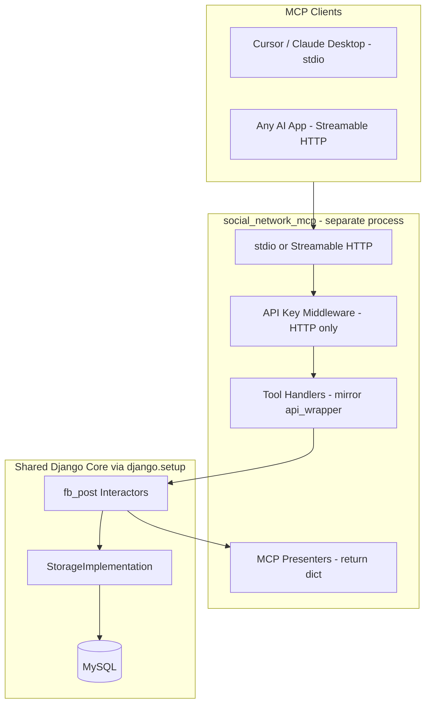

# Production-Scale MCP Server for Social Network

## Goal

Enable **any MCP-compatible AI application** (Cursor, Claude Desktop, custom agents) to call your social network operations — `create_post`, `get_post`, `create_comment`, `react_to_post`, `delete_post` — without duplicating business logic.

**Scope (confirmed):** `fb_post` only in v1.

---

## Current Foundation

Your [`fb_post`](fb_post/) app is ready:

| Operation | Interactor | Presenter interface |
|---|---|---|
| `create_post` | [`CreatePostInteractor`](fb_post/interactors/create_post_interactor.py) | `CreatePostPresenterInterface` |
| `get_post` | [`GetPostInteractor`](fb_post/interactors/get_post_interactor.py) | `GetPostPresenterInterface` |
| `create_comment` | `CreateCommentInteractor` | `CreateCommentPresenterInterface` |
| `react_to_post` | `ReactToPostInteractor` | `ReactToPostPresenterInterface` |
| `delete_post` | `DeletePostInteractor` | `DeletePostPresenterInterface` |

Each REST endpoint already follows: `api_wrapper → interactor → storage / presenter`. MCP adds a **second interface layer** with the same wiring, different presenter output format.



**Key rule:** Tool handlers do exactly what [`api_wrapper.py`](fb_post/views/create_post/api_wrapper.py) files do. Zero business logic in the MCP layer.

---

## Package Structure

New top-level package (not a Django app):

```
social_network/
├── fb_post/                          # unchanged interactors + storage
├── social_network_mcp/               # NEW
│   ├── __init__.py
│   ├── __main__.py                   # CLI: python -m social_network_mcp
│   ├── bootstrap.py                  # django.setup() once at startup
│   ├── config.py                     # env: port, transport, auth keys
│   ├── server.py                     # FastMCP factory + tool registration
│   ├── auth/
│   │   └── api_key_validator.py
│   ├── presenters/
│   │   ├── mcp_response_mixin.py     # dict responses mirroring HTTPResponseMixin
│   │   ├── mcp_create_post_presenter.py
│   │   ├── mcp_get_post_presenter.py
│   │   ├── mcp_create_comment_presenter.py
│   │   ├── mcp_react_to_post_presenter.py
│   │   └── mcp_delete_post_presenter.py
│   ├── tools/
│   │   ├── create_post_tool.py
│   │   ├── get_post_tool.py
│   │   ├── create_comment_tool.py
│   │   ├── react_to_post_tool.py
│   │   └── delete_post_tool.py
│   └── adapters/
│       └── tool_result_adapter.py    # dict → MCP JSON text content
├── Dockerfile.mcp
└── pyproject.toml                    # add mcp + uvicorn
```

---

## Layer Design

### 1. Django Bootstrap ([`bootstrap.py`](social_network_mcp/bootstrap.py))

MCP runs as a **separate process** but shares ORM + interactors:

```python
import os, django
os.environ.setdefault("DJANGO_SETTINGS_MODULE", "social_network.settings.local")
django.setup()
```

Call once in `__main__.py` before importing any `fb_post.*` modules.

### 2. MCP Presenters (one per endpoint)

Each REST presenter returns `HttpResponse` via `HTTPResponseMixin`. MCP presenters implement the **same presenter interface** but return structured dicts:

```python
# Success
{"ok": True, "status": 201, "data": {"post_id": 42}}

# Error
{"ok": False, "status": 400, "error": {"response": "...", "res_status": "INVALID_USER_EXCEPTION"}}
```

- [`mcp_response_mixin.py`](social_network_mcp/presenters/mcp_response_mixin.py): `prepare_200_success_response`, `prepare_400_bad_request_response`, etc. — mirrors [`HTTPResponseMixin`](fb_post/presenters/json_presenter.py) shape but returns dicts.
- **5 typed presenters**, each implementing its existing interface (e.g. [`CreatePostPresenterInterface`](fb_post/interactors/presenter_interfaces/create_post_presenter_interface.py)).
- For `get_post`, copy DTO→dict serialization from [`GetPostPresenterImplementation`](fb_post/presenters/get_post_presenter_implementation.py) into `McpGetPostPresenter` (keeps `fb_post` unchanged in v1).

Interactors stay untouched — they call presenter methods polymorphically.

### 3. Tool Handlers (mirror api_wrapper)

Example — `get_post` matches [`get_post/api_wrapper.py`](fb_post/views/get_post/api_wrapper.py):

```python
def handle_get_post(post_id: int) -> dict:
    from fb_post.interactors.get_post_interactor import GetPostInteractor
    from fb_post.storages.storage_implementation import StorageImplementation
    from social_network_mcp.presenters.mcp_get_post_presenter import McpGetPostPresenter

    return GetPostInteractor(post_storage=StorageImplementation()).get_post_wrapper(
        post_id=post_id,
        presenter=McpGetPostPresenter(),
    )
```

| MCP Tool | Inputs (from [`api_spec.json`](fb_post/api_specs/api_spec.json)) | Interactor method |
|---|---|---|
| `create_post` | `user_id`, `post_content` | `create_post_wrapper` |
| `get_post` | `post_id` | `get_post_wrapper` |
| `create_comment` | `user_id`, `post_id`, `comment_content` | `create_comment_wrapper` |
| `react_to_post` | `user_id`, `post_id`, `reaction_type` | `react_to_post_wrapper` |
| `delete_post` | `user_id`, `post_id` | `delete_post_wrapper` |

`reaction_type` enum: `WOW, LIT, LOVE, HAHA, THUMBS-UP, THUMBS-DOWN, ANGRY, SAD`

### 4. MCP Server ([`server.py`](social_network_mcp/server.py))

Use official **MCP Python SDK v1.x** (pin `mcp>=1.8,<2`):

```python
from mcp.server.fastmcp import FastMCP

mcp = FastMCP("social-network-fb-post", stateless_http=True)

@mcp.tool()
def create_post(user_id: int, post_content: str) -> str:
    result = handle_create_post(user_id, post_content)
    return json.dumps(result)
```

**Two transports:**

| Transport | Use case | Command |
|---|---|---|
| `stdio` | Local dev — Cursor, Claude Desktop | `python -m social_network_mcp --transport stdio` |
| `streamable-http` | Production — remote AI clients | `python -m social_network_mcp --transport streamable-http --host 0.0.0.0 --port 8081` |

- `stateless_http=True` enables horizontal scaling (no sticky sessions).
- Production: run behind Nginx/ALB with TLS; use Uvicorn ASGI via `mcp.http_app()` for multi-worker deployment.

---

## Production Concerns

### Authentication (multi-client)

Current REST API passes `user_id` in the body with no per-request OAuth. For external AI clients:

- **v1:** API key per client via `MCP_API_KEYS` env (comma-separated). Validate `Authorization: Bearer <key>` or `X-API-Key` on Streamable HTTP.
- **Future:** OAuth 2.1 per MCP spec; map token → user identity instead of raw `user_id`.

Tool-level `user_id` stays as-is (matches existing API contract).

### Scalability

- Stateless tool handlers — any replica serves any request
- N MCP containers behind a load balancer, shared MySQL via Django connection pool
- MCP process separate from Django WSGI — independent scaling and failure isolation

### Observability

- Structured logs per call: `tool_name`, `client_id`, `duration_ms`, `ok/error`
- `GET /health` custom route on HTTP transport
- Reuse [`LOGGING`](social_network/settings/base.py) from Django settings

### Security

- TLS at reverse proxy
- Validate `Origin` header (DNS rebinding protection)
- Never expose HTTP transport without auth in production
- Rate limiting per API key (phase 2)

---

## Dependencies

Add to [`pyproject.toml`](pyproject.toml):

```toml
[tool.poetry.dependencies]
mcp = ">=1.8,<2"
uvicorn = { version = "^0.34", extras = ["standard"] }

[tool.poetry.scripts]
social-network-mcp = "social_network_mcp.__main__:main"

# packages list — add:
# { include = "social_network_mcp" }
```

---

## Client Connection

**Cursor** (`.cursor/mcp.json` — stdio, local):

```json
{
  "mcpServers": {
    "social-network": {
      "command": "poetry",
      "args": ["run", "python", "-m", "social_network_mcp", "--transport", "stdio"],
      "env": {
        "DJANGO_SETTINGS_MODULE": "social_network.settings.local"
      }
    }
  }
}
```

**Remote AI app** (Streamable HTTP):

```json
{
  "mcpServers": {
    "social-network": {
      "url": "https://mcp.your-domain.com/mcp",
      "headers": {
        "Authorization": "Bearer your-api-key"
      }
    }
  }
}
```

---

## Testing Strategy

| Layer | What to test |
|---|---|
| `McpResponseMixin` | Dict shapes match REST response bodies |
| Each MCP presenter | Success + error paths per endpoint |
| Tool handlers | Delegate to interactors (mock storage, same as [`fb_post/tests/views/`](fb_post/tests/views/)) |
| Integration | In-process MCP server; call all 5 tools against test DB |
| Auth | Reject HTTP requests without valid API key |

---

## Implementation Phases

### Phase 1 — MVP (local + core tools)
- Scaffold `social_network_mcp/` package + Django bootstrap
- `McpResponseMixin` + 5 typed MCP presenters
- 5 tool handlers + FastMCP server with stdio transport
- Unit tests for presenters + one tool handler

### Phase 2 — Production hardening
- Streamable HTTP transport + API key auth middleware
- Structured logging + `/health` endpoint
- `Dockerfile.mcp` + env config docs
- Integration test suite for all 5 tools
- Example `.cursor/mcp.json`

### Phase 3 — Scale and extend (future)
- Rate limiting, OAuth 2.1, Prometheus metrics
- MCP Resources (`post://{id}` read-only URIs)
- MCP Prompts (e.g. "summarize post thread")
- Expand to `users` app when needed

---

## What NOT to Change

- **Do not modify interactors or storage** — MCP is purely a new interface
- **Do not duplicate business logic** in tool handlers
- **Do not use MCP SDK v2 / standalone `fastmcp` 3.x** until stable — stick to `mcp` package v1.x
- **Do not put MCP inside `fb_post/`** — keep it a separate deployable package
